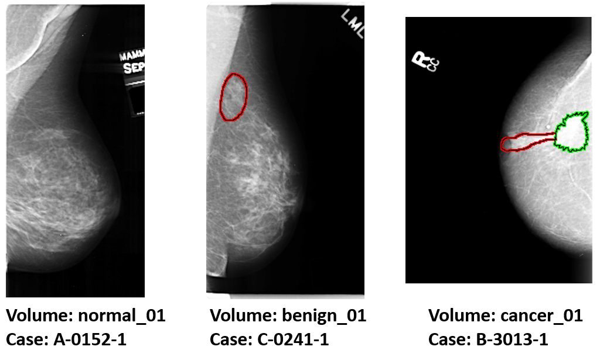
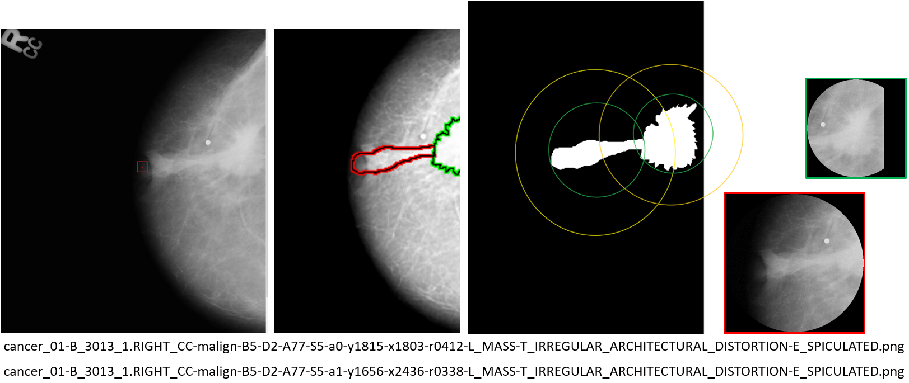
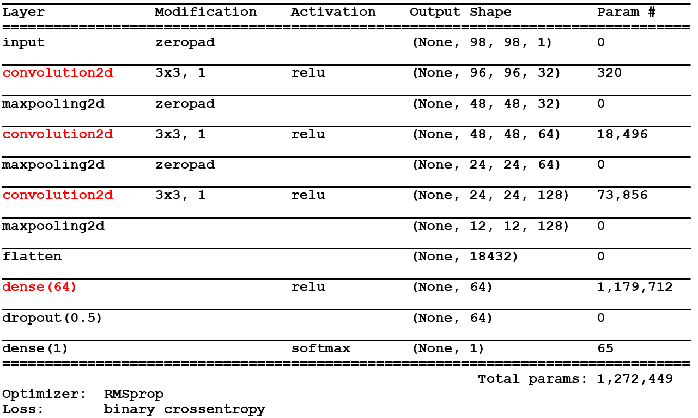
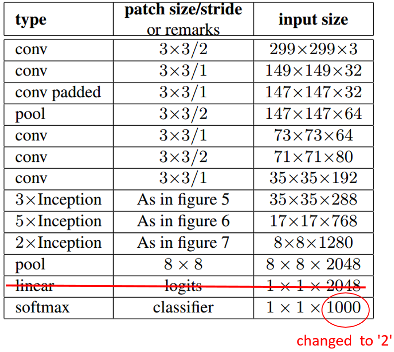
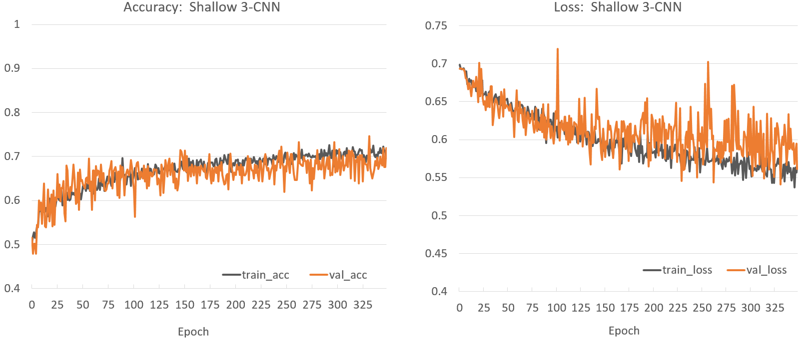
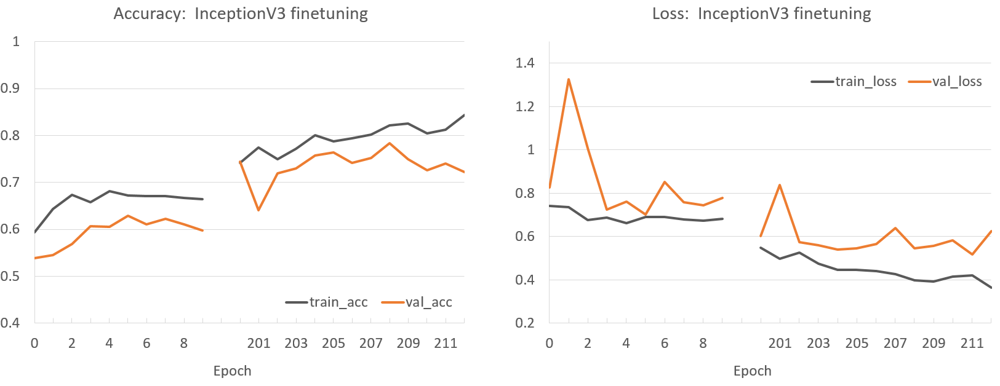
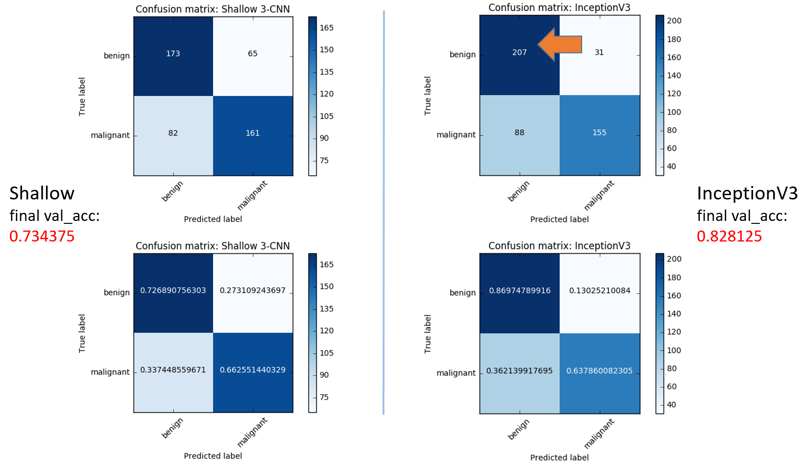
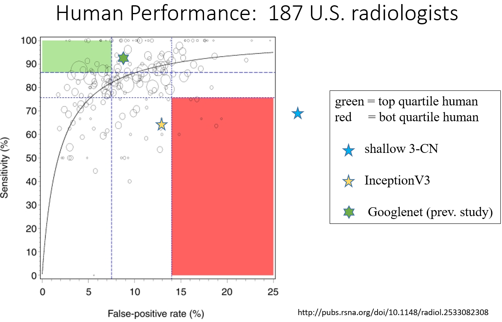

## Project Report - CS6501-003 - CNN for Mammography: distinguishing benign vs. malignant masses
Jeffrey Xing

### Abstract

This project's inspiration comes from Vibhu Agarwal's and Clayton Carson's paper "Using Deep Convolutional Neural Networks to Predict Semantic Features of Lesions in Mammograms" [1] as well as Arzav Jain's and Daniel Levy's paper "DeepMammo: Breast Mass Classification using Deep Convolutional Neural Networks" [2]. 
We attempt to reproduce and build on their prior work classifying 2D-mammography X-ray images of lesions into malignant or benign by employing a convolutional neural network (CNN) architecture. 
We implement and test two architectures at varying depths, ultimately achieving the best performance with a fine-tuned InceptionV3 model (83% accuracy, 64% sensitivity, 13% false positive rate), which is on par with the lower quartile of human performance. 

### Introduction

Breast cancer is the number one leading cancer among females, and the second most fatal type in the same group [3].
2D Xray screening mammograms are currently considered to be the best method for early detection of breast cancer, although 3D tomosynthesis is becoming more popular (this is equivalent to a mammogram taken at multiple angles and synthetically reconstructed into a 3D stack). 
The interpretation and diagnosis by radiologists is still a manual and laborous process with high variance depending on the interpreter [4]. 
Methods for standardizing and improving diagnosis are still being explored. 
This paper examines previous approaches using convolutional neural network architecture to reduce feature-engineering and automatically learn a model from labeled data. 

### Dataset

The dataset used is one of the largest publicly available radiographic imaging databases: Digital Database for Screening Mammography (DDSM) [5]. 
The full database contains roughly 2620 cases (patients), curated to contain well-balanced class distribution: (695 normal, 870 benign, 914 cancer, 141 benign with callback). 
The advantage of this dataset is that for regions of interest in each high-resolution (16bit, ~4000 x ~2000) image, there are a) expert radiologist annotated boundary shapes, b) clinically relevant physician's interpretation of the shape, and most importantly c) biopsy/pathology validated ground-truth status of the lesion. 
A representative sample is shown in Figure 1. 

##### Figure 1. Original images with overlaid region boundary 

For this project, we only consider single contiguous masses (not calcifications, which tend to be star-like clusters of punctate dots) to stratify the problem into a more defined sub-challenge. 
To generalize better, we split our data by patient (instead of by image) into 80% train and 20% validation. 
The final distribution after selecting masses is shown in Table 1.
Although not huge when comparing with other machine learning image datasets, it is one of the largest available datasets in the medical imaging field; thus, it is hoped that these are sufficient to yield promising proof-of-concept results.

##### Table 1a. Number of patient cases in masses subset.
| |Benign | Malignant | Both | **Total**
|---|---|---|---|---|---
| Patients | 515 | 581 | 21 | 1117

##### Table 1b. Number of individual masses in training/validation split.
| | Benign | Malignant | **Total**
|---|---|---|---
| Train | 903 | 978 | 1881
| Validation | 238 | 243 | 481 

### Preprocessing

##### Decompressing raw data
As the raw images are in an obscure, old format (data is from 1990s), a preprocessing utility [6] was used to convert them to PNM intermediate format, whereupon an imagemagick wrapper [7] is used to convert to 16bit PNG. 
This utility [6] also claims to normalize batch effects due to different scanners/institutions used during data collection. 

##### Cropping region of interest
The associated boundary "overlay" files were parsed, along with lesion-specific clinical metadata, and converted to filled binary masks. 
A minimum enclosing circle was then calculated for each mass and the circular region of twice the diameter, was then cropped from the original image to include 50% margin as context for learning. 

##### Figure 2. Example crops from image with 2 masses 

##### Data augmentation
Because dataset is small, we augment the training data in real-time during training, by random rotation 0-360 degrees, and random horizontal/vertical flip. 
The real-time augmentation on CPU was chosen to yield a wider augmentation variety than _a priori_ fixed multiplier. 
The validation data was not augmented.
Finally, the input images were also resized to 96x96 pixels for Shallow 3-CNN and 299x299 pixels for adapted InceptionV3. 
Additionally, the single channel grayscale was duplicated across 3 channels for InceptionV3 since the pretrained architecture requires 3 color channels.

### Model architecture
As a baseline comparison, we implemented a relatively shallow 3 convolutional layer model similar to "Levy Net" [2]. 
Based on the GoogLeNet performance from [2], we then decided to try its corresponding updated version InceptionV3 [8]. 
The ImageNet pretrained weights were loaded, and the dense/fully-connected layers were stripped from the top and replaced with a single 2-neuron layer with softmax activation for 2 class categorical classification. 
Where applicable, an L2-regularizer (l2=0.001) was added to the weights of both models to combat overfit. 
The architectures are shown in Figure 3. 

##### Figure 3a. Shallow architecture

##### Figure 3b. (adapted) InceptionV3 architecture

### Model Training
Both models were implemented in keras [9] with tensorflow [10] backend and trained on gpu. 
The Shallow 3-CN was trained from scratch with batch_size=128, using RMSprop(lr=0.001, rho=0.9, epsilon=1e-08, decay=0.0) optimizer, and loss=binary_crossentropy. 
The InceptionV3 model was fine-tuned with batch_size=32, optimizer=SGD(lr=.01, decay=0.0002, momentum=0.9, nesterov=False) and loss=categorical_crossentropy. Specifically, only the classification layer was finetuned for 200 epochs, after which Inception block 5 was also unfrozen and finetuned for another ~10 epochs. 
Some of the training logs for InceptionV3 were accidentally overwritten. Due to its heavy computational cost, we did not regenerate these values on a separate run.
The training progress is shown in Figure 4.

##### Figure 4. Training progress

### Results
Our Shallow net achieved a final validation accuracy of 73%, which surpasses the 60% result achieved by the similar "LevyNet" architecture [2] despite having 1 fewer densely connected layer. 
Our InceptionV3 adaptation, however, achieved a final validation accuracy of 83% compared to the 93% of GoogLeNet from [2]. 
For our best model, representative false positives, false negatives, true positives, and true negatives are shown in the supplementary power point. 
Looking at these representative images, some of the error may be due to artifacts in the images but others seem like legitimate errors due to the difficulty of the problem: some benign lesions do indeed look indistinguishable (to the layperson) from malignant lesions. 
In general, the deeper model improves upon the shallow model at reducing false positives, which explains the majority of the accuracy gains. 
The confusion table for both models are shown in Figure 5. 

##### Figure 5. Confusion table

We speculate that the poorer performance of our deep architecture may be due to differences in the training process ([2] also allowed earlier layers to learn by setting a low learning rate multiplier of 0.1) or differences in architecture ([2] kept as many fully connected layers as possible). 
Even so, our best model is still on par with the bottom quartile of human performance as shown in Figure 6.

##### Figure 6. Human benchmark

### Future work

##### Model & Feature visualization
To better understand why the model is performing accurately on some images but not on others, we can try to visualize features learned through deconvolutional approaches or indirectly, such as  masking parts of an image and measuring response on the prediction confidence. 

##### Data cleaning
There are many annotations that, time permitting, may require flagging images for removal or special handling. 
As an example, one image warns: "The LEFT_CC image has a scanner artifact in it. The rollers slipped while the image was scanning. That is why the letters look distorted." 
Some images are distorted, perhaps due to small boundary shapes, which were then upsampled.

##### Data expansion
Deep learning approaches often require thousands or millions of samples to train on. 
Therefore a larger future dataset or aggregating multiple smaller datasets together would be helpful. 

### References

[1] http://cs231n.stanford.edu/reports/vibhua_final_report.pdf

[2] http://cs231n.stanford.edu/reports2016/306_Report.pdf

[3] https://www.ncbi.nlm.nih.gov/pubmed/18003123

[4] https://www.ncbi.nlm.nih.gov/pmc/articles/PMC2786197/

[5] http://marathon.csee.usf.edu/Mammography/Database.html

[6] https://github.com/multinormal

[7] https://github.com/trane293/DDSMUtility

[8] https://github.com/tensorflow/models/tree/master/inception

[9] https://github.com/fchollet/keras

[10] https://github.com/tensorflow/tensorflow

